# 贡献指南/Contributing Guide

## 投稿指南

1. 在首页点击「我要投稿」，或在任意文档右上角使用「编辑」/「我要投稿」按钮
   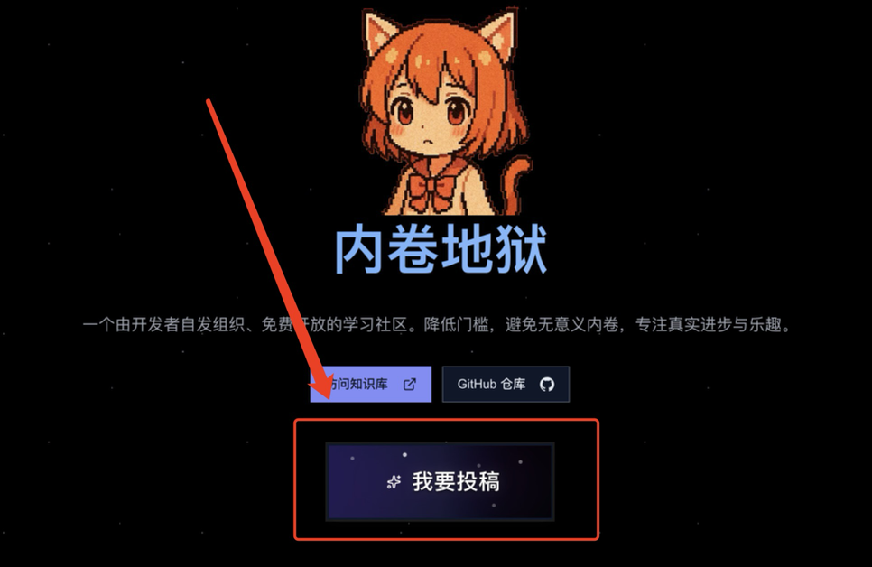

2. 浮窗中选择想贡献的章节，也可以先新建一个文件夹
   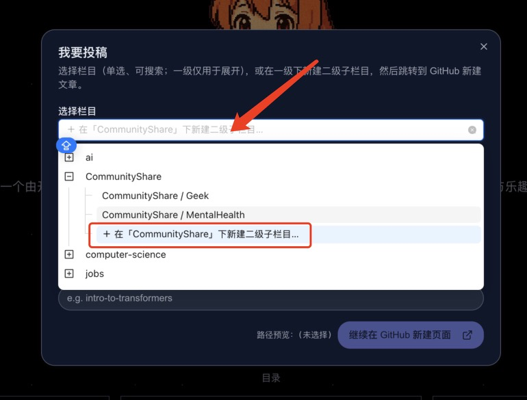
   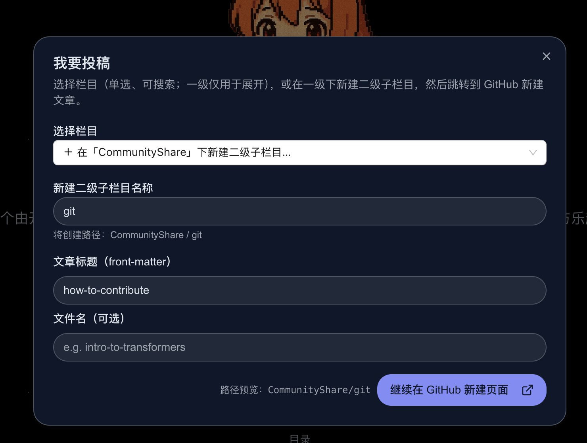
   选好后点击「下一步」

3. 页面会跳转到 GitHub，新建文档时请保留顶部 Frontmatter 结构
   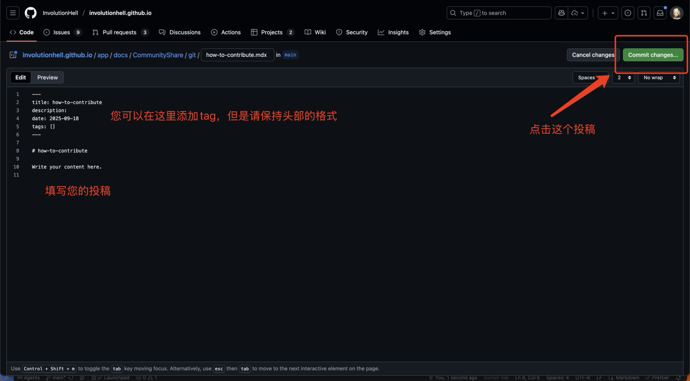

4. 点击 `Commit changes`，若是第一次投稿，GitHub 会提示先 Fork 仓库；按提示操作一次即可
   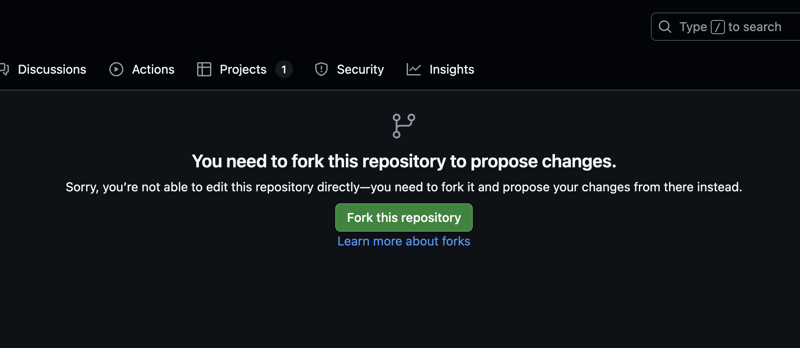

5. Fork 完成后会自动返回原页面，然后一直“下一步”即可
   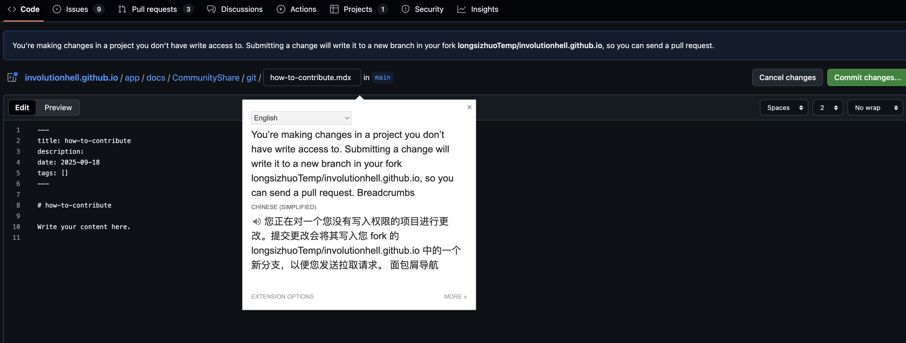
   再点击一次 `Commit changes`
   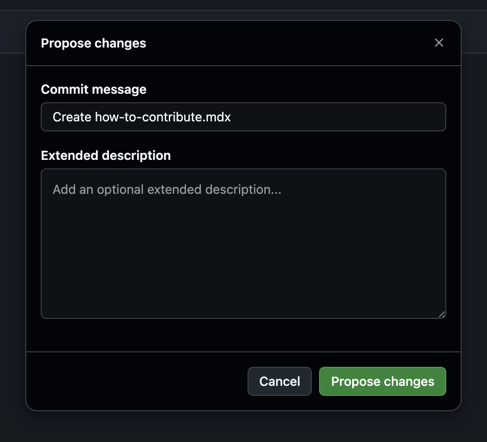
   随后进入 PR 流程，按提示一路继续
   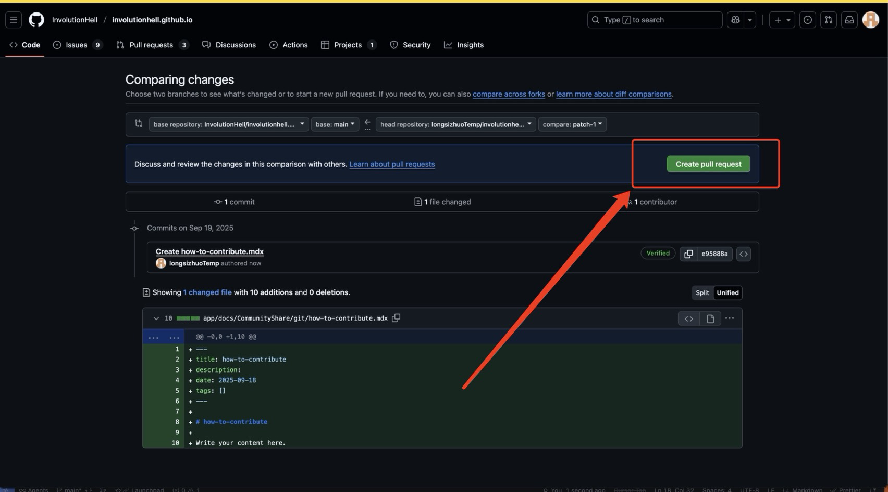
   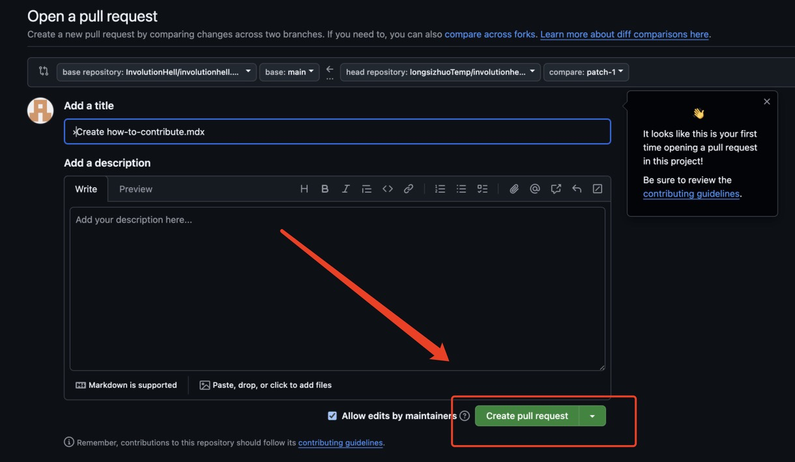

6. 恭喜你完成了首次 Pull Request！ 🎉
   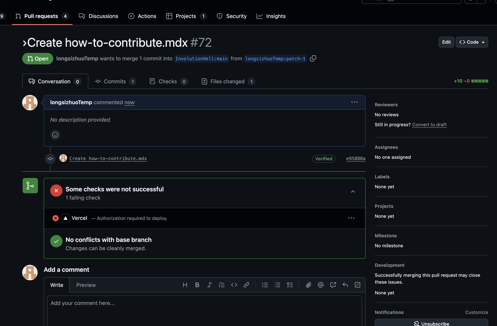

—— 以下是代码贡献流程，若只提交文档可在此结束 ——

---

## Git 提交 Guide

#### 1. 将本项目直接fork到自己的账号下，这样就可以直接在自己的账号下进行修改和提交。


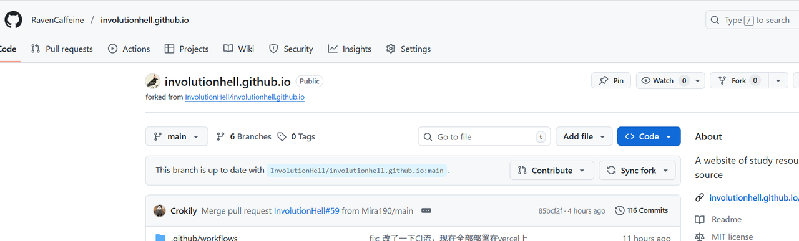

_注意取消勾选仅克隆当前分支_

#### 2. 克隆项目

```
git clone https://github.com/你自己的仓库名/involutionhell.github.io.git
```

修改为自己fork的仓库，改为你的https仓库的git地址

#### 3. 创建自己的分支

列出现有分支

```
git branch -a  #用于列出当前Git仓库中所有的分支,包括本地分支和远程分支。
```

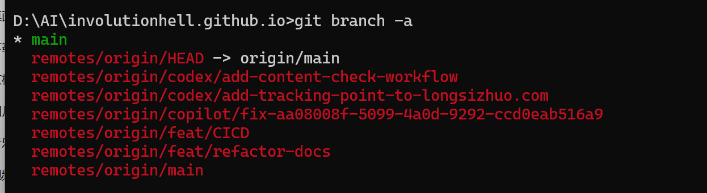

##### 3.1 创建功能分支的约定命名

```
git checkout -b feat/your-feature

# 它的作用是创建一个新的分支并立即切换到该分支上。

具体来说，这个命令相当于同时执行了两个操作：
git branch feat/your-feature - 创建名为 feat/your-feature 的新分支
git checkout feat/your-feature - 切换到这个新创建的分支

其中 feat/your-feature 是分支名称，通常遵循约定式命名：

feat/ 前缀表示这是一个功能（feature）分支
后面的 your-feature 通常是对功能的简要描述
```

##### 3.2 创建文档分支的约定命名

```
git checkout -b doc_raven   # 自定义一个新的分支
#git checkout -b doc_id 分支名字改为你的uid分支名称
```

#### 4. 提交更改分支

```
git add .
根据你的变动情况
git commit -m "add xxx" # 添加信息记录
or
git commit -m "edit xxx" # 修改信息记录
or
git commit -m "delete xxx" #删除信息记录
```

#### 5. 推送分支到远程仓库

```
git push origin doc_raven
```

---

## 🚀 开发环境

### 1. 克隆仓库

```bash
git clone https://github.com/involutionhell/involutionhell.github.io.git
cd involutionhell.github.io
```

### 2. 安装依赖

```bash
npm install
```

### 3. 本地开发

运行开发服务器：

```bash
npm dev
```

打开浏览器访问 [http://localhost:3000](http://localhost:3000)。

修改 `docs/` 下的 `.md` 或 `.mdx` 文件，会自动热更新。

---

## 📚 文档规范

所有文档放在 `docs/` 目录。
图片需要放在 被引用的文档的同名`assets`目录下(正常情况下您不应该关心这个, 该项目有自动脚本来移动图片), 例如:
docxA 引用了 imgA 图片, 那么他们的文档结构应该是 `docxA.assets/imgA`:

```md
docsA.mdx
docsA.assets/
imgA
```


每个文档都需要一个 Frontmatter，例如：

```md
---
title: Hello World
description: 简短描述
date: "2025-09-11"
tags:
  - intro
---

# Hello World

这是正文内容。
```

**必填字段:**

- **title**: 必填，文档标题

**可选字段:**

- **description**: 简短说明
- **date**: 发布日期
- **tags**: 标签列表

---

## 📁 目录结构

我们的文档采用分层式的 **"Folder as a Book"** 结构，会自动生成 URL 和导航。

### 当前结构

```
📂 docs/
├── 📂 computer-science/           # 计算机科学
│   ├── 📄 index.mdx               # 概述
│   └── 📂 data-structures/        # 数据结构
│       ├── 📄 index.mdx           # 概述
│       ├── 📂 array/              # 数组
│       │   ├── 📄 index.mdx       # 概述
│       │   ├── 📄 01-static-array.mdx    # 静态数组
│       │   └── 📄 02-dynamic-array.mdx   # 动态数组
│       └── 📂 linked-list/        # 链表
│           ├── 📄 index.mdx       # 概述
│           └── 📄 01-singly-linked-list.mdx  # 单向链表
```

### URL 生成

文件结构会自动生成简洁的 URL：

- `docs/computer-science/index.mdx` → `/computer-science`
- `docs/computer-science/data-structures/array/01-static-array.mdx` → `/computer-science/data-structures/array/static-array`

### 命名约定

**文件夹:**

- 使用 `kebab-case` 命名: `computer-science`, `data-structures`
- 每个主题文件夹应该有一个 `index.mdx` 文件作为概述

**文件:**

- 使用 `kebab-case` 命名: `static-array.mdx`
- 使用数字前缀排序: `01-`, `02-`
- 前缀会自动从最终 URL 中移除

---

## 📝 写作指南

### 内容质量

- **准确性**：确保技术准确性
- **清晰性**：编写清晰易懂的解释
- **完整性**：全面覆盖主题
- **示例**：包含实际代码示例
- **更新**：保持内容更新

### Markdown 最佳实践

- 使用正确的标题层次结构 (h1 → h2 → h3)
- 包含带有语法高亮的代码块
- 使用表格进行比较
- 为图片添加替代文本
- 使用链接引用相关内容

### 代码示例

```javascript
// ✅ 好的做法：清晰、有注释的代码
function binarySearch(arr, target) {
  let left = 0;
  let right = arr.length - 1;

  while (left <= right) {
    const mid = Math.floor((left + right) / 2);

    if (arr[mid] === target) {
      return mid; // 找到目标
    } else if (arr[mid] < target) {
      left = mid + 1; // 搜索右半部分
    } else {
      right = mid - 1; // 搜索左半部分
    }
  }

  return -1; // 未找到目标
}
```

### 语言风格

- **英文**：使用清晰、专业的英文
- **中文**：在需要时使用正式的学术中文
- **技术术语**：使用标准技术术语
- **一致性**：在整个文档中保持一致的术语

---

## 🏗️ 构建与导出

### 构建（生成 .next）

```bash
pnpm build
```

这会在 `.next` 文件夹中创建优化的生产构建。

### 静态导出（生成 /out 目录）

```bash
pnpm export
```

导出后的 `/out` 目录包含静态站点，可直接部署到 GitHub Pages。

---

## 🚢 部署

本仓库配置了 **GitHub Actions**，push 到 `main` 分支会自动构建并部署到：

👉 [https://involutionhell.github.io/](https://involutionhell.github.io/)

无需手动操作。

---

## 🤝 如何贡献

### 基本工作流程

1. Fork 本仓库
2. 为修改创建新分支
3. 进行修改
4. 测试修改
5. 提交 PR

### 贡献类型

我们欢迎以下类型的贡献：

**📝 内容贡献**

- 修正文档内容
- 添加新的教程或指南
- 将内容翻译成其他语言
- 改进现有文章

**🐛 错误修复**

- 修复拼写和语法错误
- 修复损坏的链接
- 修复错误信息
- 改进代码示例

**🎨 UI/UX 改进**

- 改进页面样式
- 增强用户交互
- 改进移动端响应性
- 为 UI 添加新功能

#### 💡 UI 开发建议

**优先使用 Fumadocs UI 组件库**：

本项目已迁移到 **Fumadocs UI** 作为主要 UI 框架。请在进行 UI 相关开发时优先考虑：

1. **使用 Fumadocs UI 组件**：
   - 查看 [Fumadocs UI 文档](https://fumadocs.dev/docs/ui) 了解可用组件
   - 优先使用内置组件而不是自定义实现
   - 遵循 Fumadocs UI 的设计规范和样式指南

2. **保持设计一致性**：
   - 使用统一的颜色方案和字体
   - 遵循现有的组件样式和交互模式
   - 保持响应式设计的兼容性

3. **新功能开发**：
   - 在提 issue 讨论新功能需求时，请明确 UI 方面的具体要求
   - 优先考虑使用 Fumadocs UI 的扩展功能
   - 如需自定义组件，请与团队讨论以保持一致性

4. **测试要求**：
   - 确保新 UI 功能在不同设备和屏幕尺寸下正常工作
   - 测试主题切换（浅色/深色模式）兼容性
   - 验证无障碍访问功能

**🛠️ 技术改进**

- 改进构建过程
- 添加新的脚本或工具
- 优化性能
- 改进可访问性

---

## 🔄 代码审查流程

1. **自动检查**
   - GitHub Actions 将运行自动化测试
   - Fumadocs 将验证你的内容
   - Linting 将检查代码质量

2. **同行评审**
   - 至少一位维护者将审查你的 PR
   - 审阅者可能会要求修改
   - 你可以根据反馈更新你的 PR

3. **合并**
   - 一旦批准，维护者将合并你的 PR
   - 你的贡献将自动部署
