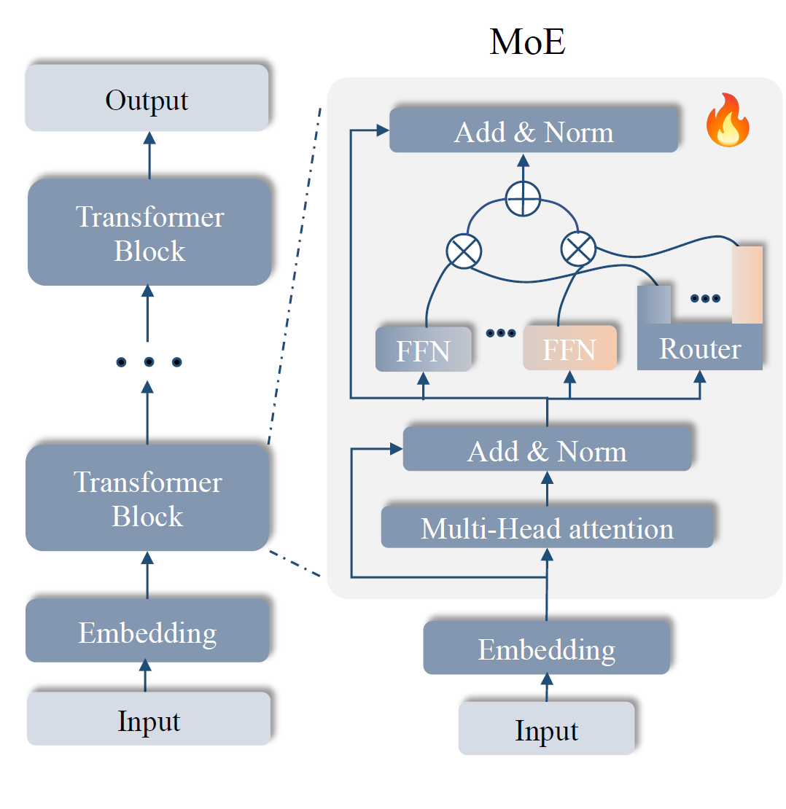
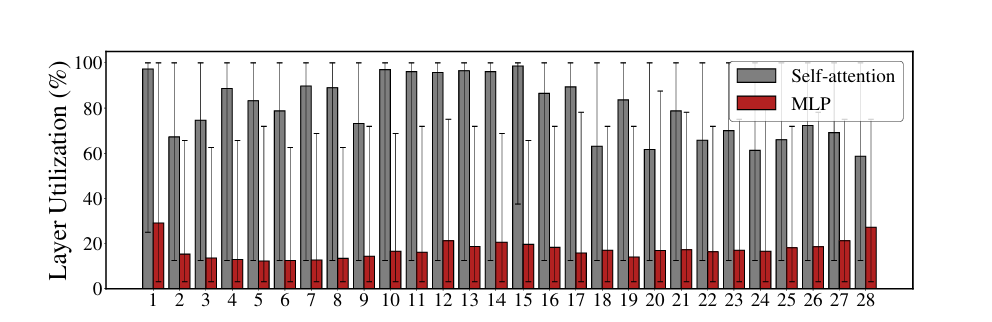
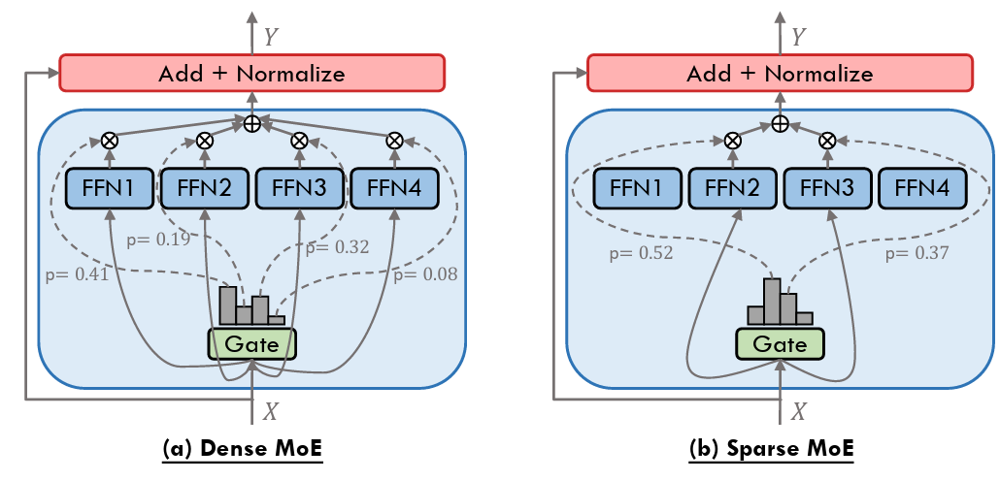

# 混合专家（Mixture of Experts, MoE）架构

为了在不显著增加计算需求的情况下有效扩展模型参数规模，MoE 架构已经成为一种可行的解决方案。MoE 利用一组专门化的子模型和一个门控机制，动态地选择合适的“专家网络”来处理给定输入。这使得模型能够根据需求分配计算资源，这一概念被称为 **条件计算（conditional computation）**。

MoE 架构已经被广泛应用到大语言模型（LLMs）中，使这些模型能够在参数规模显著扩大的同时，获得相应的能力提升。  
例如，Mixtral AI 提出的 **Mixtral-8x7B** 管实际激活的参数量仅有 130 亿，**在多个基准测试上表现优于或相当于 Llama-2-70B 和 GPT-3.5**。

---

## 传统 MoE 架构

自 MoE 最早被引入 Transformer 架构以来，MoE 主要作为 **前馈网络 (FFN)** 的替代模块使用。通常情况下，MoE 层中的每个专家都直接复制了其所替换的 FFN 结构。然后配备有一个 Router 来训练具体交给哪个专家处理。

MoE 主要应用于 FFN 层，而不是自注意力层，原因在于：

- **注意力层**：稀疏性较低，更适用于全局交互。
- **FFN 层**：稀疏性较高，更具有领域特性。  
  其中 DS-MoE 使用 Wikitext 作为任务时，发现：FFN 层的专家仅有 **20%** 被激活  
  而注意力层激活率高达 **80%**。这种高利用率表明注意力层的核心通讯机制不适用于特异化的专家。反之具有稀疏特性的 FFN 层，具有完整多专家特异化的潜力。

---

## Routing 机制：Dense MoE 与 Sparse MoE

- **Dense MoE**
  - gate 对于输入 token 使用 **softmax** 路由机制，传递给每个专家一定权重。
  - 优点：训练稳定。
  - 缺点：每次都要计算所有专家，计算成本高。

- **Sparse MoE**
  - 使用 **Top-K** 路由机制，仅激活前 K 个权重最大的专家。
  - 优点：极大减少计算量，这是目前主流模型（如 GShard、Switch Transformer、Mixtral、DeepSeek-MoE）的策略。
  - 缺点：Router 训练变复杂，容易出现「热门专家被频繁使用，冷门专家学不到东西」的问题 → **路由坍塌**。
  - 解决办法：训练中需要引入额外的 **负载均衡损失**。

---

## 专家个数选择

**GLaM (Google, 2021)** 在实验中探索了不同专家数量与 gating 策略的组合：  
发现 **64 个专家（per layer）+ Top-2 gating** 在性能和计算效率之间达到了最佳平衡。  
Top-2 gating 能显著提升效果，相比单一专家更稳定。并且 64 专家的配置在 **zero-shot、one-shot、few-shot** 场景下均表现优异。 所以后续的很多 MoE 工作（如 Mixtral, DBRX, DeepSeekMoE）也基本采用 ≤64 专家的规模，这个设计在实际应用中也具有参考价值。

---

## MoE 与 PEFT

近期仍有不少工作专注于 PEFT（参数高效微调）。  
论文 [_Pushing Mixture of Experts to the Limit: Extremely Parameter Efficient MoE for Instruction Tuning_](https://arxiv.org/abs/2309.05444) 首次提出将 **LoRA 类型的 PEFT 方法和 MoE 框架结合**。  
其主要理念为，不直接在整个大模型上加 LoRA，而是专门在 MoE 的 expert 模块里应用 LoRA。因为 MoE 的每个专家就是 FFN（MLP），它们是知识写入的关键位置。这样每次只动一小部分 LoRA experts，并且大大增强了这种架构的易扩展性。

该方法的核心思想是利用 **低秩近似更新** 来避免高级算力的微调。

1. **输入 (Input → Embedding)**
   - 输入 token（字或子词）先经过 Embedding。
   - 这部分和普通 Transformer 一样。

2. **Multi-Head Attention**
   - 输入 embedding 进入多头注意力模块。
   - 在这里，Q、K、V 一切正常，完全没被 LoRAMoE 改动。
   - 输出再走 **Add & Norm**，结果传给 FFN。

3. **FFN → MoE (Expert 路由)**
   - 普通 Transformer 的 FFN 被换成 **LoRA + MoE 专家网络**。
   - Router 根据输入选择若干专家，每个专家是 **LoRA 化（低秩适配）的模块**，而不是全量可训练的 FFN。
   - 冻结的部分（❄️）是预训练的大模型主干。
   - 火花（🔥）表示 LoRA Adapter（可训练参数，低秩矩阵）。
   - Router 输出的加权组合：

   $$
   y = \sum_i \alpha_i \cdot Expert_i(x)
   $$

   其中 $\alpha_i$ 是 Router 根据输入算出来的权重。

4. **输出 (Add & Norm → Residual)**
   - Router 混合后的专家输出，和残差连接一起进入 Add & Norm，继续往后层传。

---

#### LoRA 拆解

LoRA（Low-Rank Adaptation）的核心思想：

对一个大的线性层权重 $W \in \mathbb{R}^{d_{out} \times d_{in}}$，不去训练整个矩阵，而是加上一个低秩近似更新：

$$
W' = W + \Delta W, \quad \Delta W = BA
$$

- $A \in \mathbb{R}^{r \times d_{in}}, B \in \mathbb{R}^{d_{out} \times r}$
- 秩 $r \ll d_{in}, d_{out}$，通常只取个位数到几十
- $W$：冻结（❄️，预训练参数）
- $A, B$：可训练（🔥，参数量大幅减少）

这样，一个输入向量 $x$ 经过 LoRA 线性层时：

$$
Wx + BAx
$$

等于 **原始主干输出 + 一个小的低秩修正**。

回到该图，我们可以发现每个专家 $Expert_i$ 不是全新的大 FFN，而是 **一个 FFN 的 LoRA adapter 组合**：

$$
Expert_i(x) = B_i A_i x
$$

- Router 对输入 hidden state 计算一个分布 $\alpha$，然后加权组合：

$$
y = \sum_i \alpha_i \cdot Expert_i(x)
$$

- 最终结果再加上主干（冻结的 FFN 权重输出）：

$$
y_{final} = W_{FFN}x + \sum_i \alpha_i \cdot B_i A_i x
$$

---

作者：**Yang Lewis**  
非商业转载请标明出处。  
商业转载请联系作者：**840691168ly@gmail.com**
