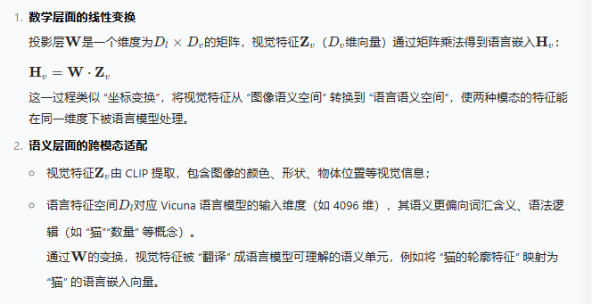

LLaVA (Large Language and Vision Assistant) �Ƕ�ģ̬��ģ�͵Ŀ����Կ�ܣ��������Ӿ�ָ����ŵ��·�ʽ��


## ���ļܹ�

### �����ṹ

```
ViT�Ӿ������� �� ͶӰ���ģ̬���� �� LLM��������
```




### �����ص�

- **�Ӿ�����**: ʹ��Ԥѵ����Vision Transformer����ͼ��
- **��ģ̬����**: ͨ��ͶӰ�㽫�Ӿ�����ӳ�䵽���Կռ�
- **��������**: ����LLM���ж�ģ̬���������
- **ָ�����**: �������Ӿ�ָ����ŵ��·�ʽ

## ѧϰ��Դ

### ��������

- **����**: [Visual Instruction Tuning](https://arxiv.org/abs/2304.08485)
- **����**: [LLaVA GitHub](https://github.com/haotian-liu/LLaVA)
- **��ɫ**: �״�����Ӿ�ָ����Ÿ���

### CLIP����

**CLIP (Contrastive Language-Image Pre-training)** �Ƕ�ģ̬ѧϰ����Ҫ����������

**�ܹ����**:

- **˫���ṹ**: Text Encoder + Image Encoder
- **�Ա�ѧϰ**: ͨ��(image, text)���ݶԽ���Ԥѵ��
- **����������**: ǿ���ͼ��ƥ��ͷ�������

**ѧϰ��Դ**:

- **����**: [Learning Transferable Visual Representations](https://arxiv.org/abs/2103.00020)
- **����**: [OpenAI CLIP](https://github.com/openai/CLIP)

### LLaVA������Ŀ

�ƻ�����LLaVAģ�ͣ����������ģ̬ģ�͵�ѵ�����̺ͼ���ϸ�ڡ�

## ������Ƚ���

### �Ӿ�ָ�����

**����˼��**: ��ģ��ѧ�������ִ�л���ͼ���ָ�

**���ݹ���**:

- ͼ����������
- �Ӿ��ʴ�����
- ������������
- ָ����ѭ����

### ��ģ̬����

**������ս**: �Ӿ�������ģ̬������ռ����

**�������**:

- ����ͶӰ��ӳ��
- �Ա�ѧϰԤѵ��
- ����������ѵ��
- ����ʽ�������

## Ӧ�ó���

### ͼ������

- **ͼ������**: �Զ�����ͼ�����ϸ����
- **�Ӿ��ʴ�**: ����ͼ�����ݻش�����
- **��������**: ���⸴�ӳ�������Ϊ
- **ϸ�ڼ��**: ʶ��ͼ���еĹؼ�ϸ��

### ��������

- **�Ӿ���ѧ**: ����ͼ���֪ʶ����
- **��ҵ����**: ��������ͼ����ʾ��
- **��������**: �����Ӿ����ݵĴ�������
- **ѧϰ����**: �Ӿ���ѧϰЧ������

### ���ݴ���

- **���´���**: ����ͼ��������
- **Ӫ���İ�**: ��Ʒͼ�����������
- **�罻ý��**: ͼƬ���ĺ�hashtag����
- **�������**: ���˼·�͸������

## ѧϰ����

1. **CLIP����**: �����ģ̬Ԥѵ��
2. **���ľ���**: �����о�LLaVA����ϸ��
3. **�������**: �Ķ��ٷ�ʵ�ִ���
4. **����ʵ��**: ���Լ򻯰汾ʵ��
5. **Ӧ�ÿ���**: ����ʵ��Ӧ�ó���

LLaVA��Ϊ��ģ̬��ģ�͵���̱�������Ϊ�����Ӿ����Խ����͹������ܶ�ģ̬ϵͳ�ṩ����Ҫ������
